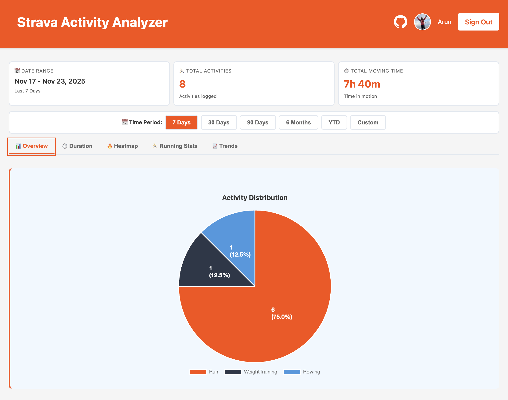
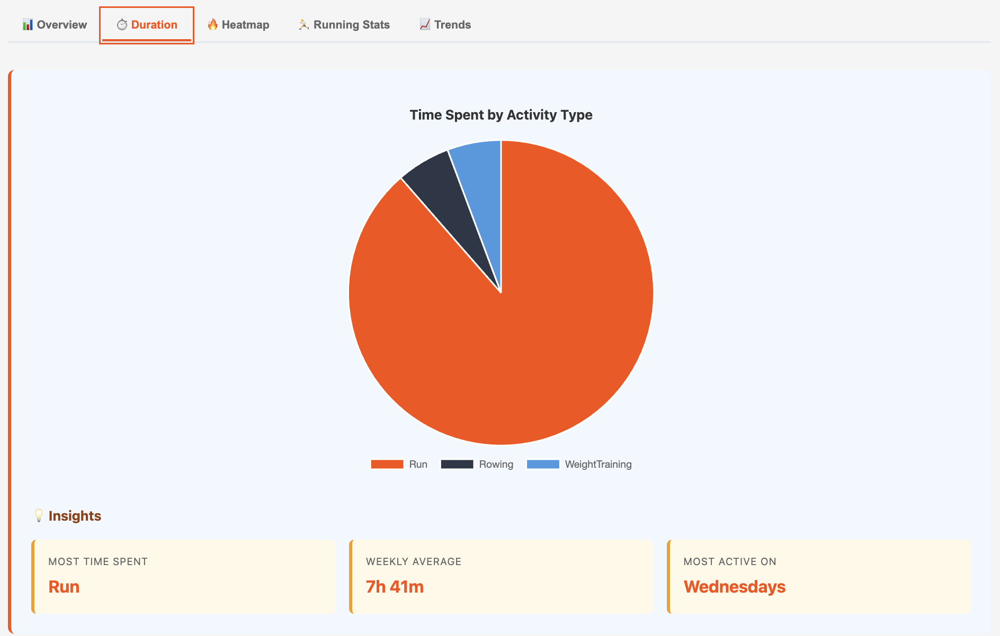
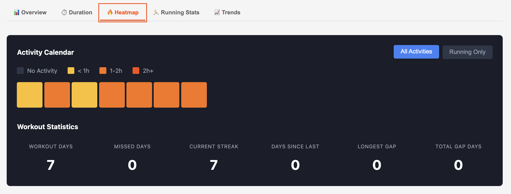
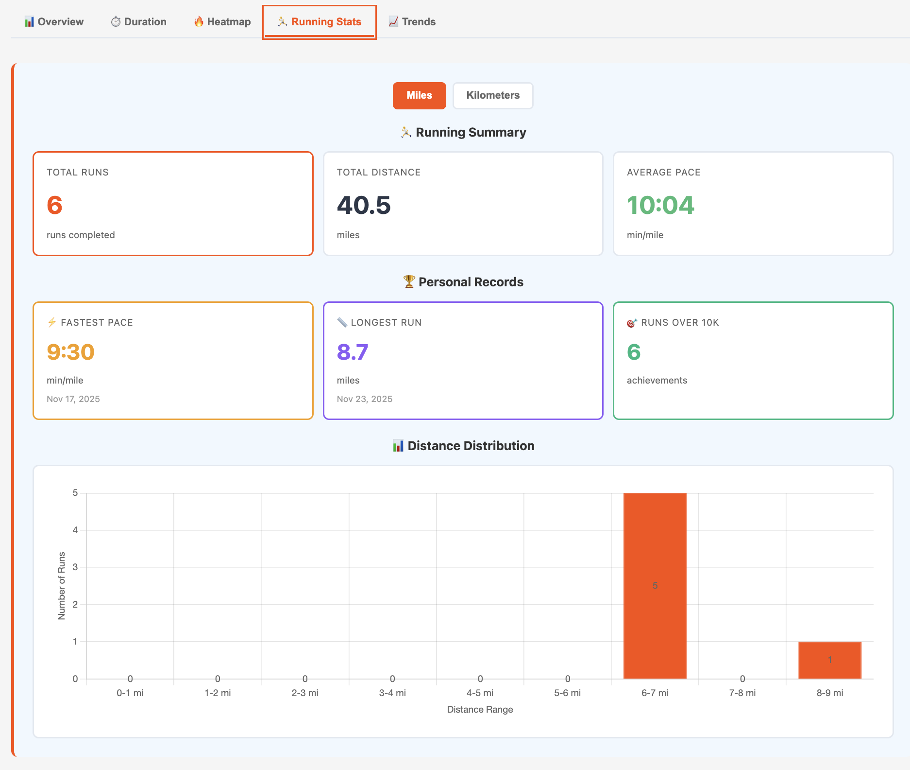
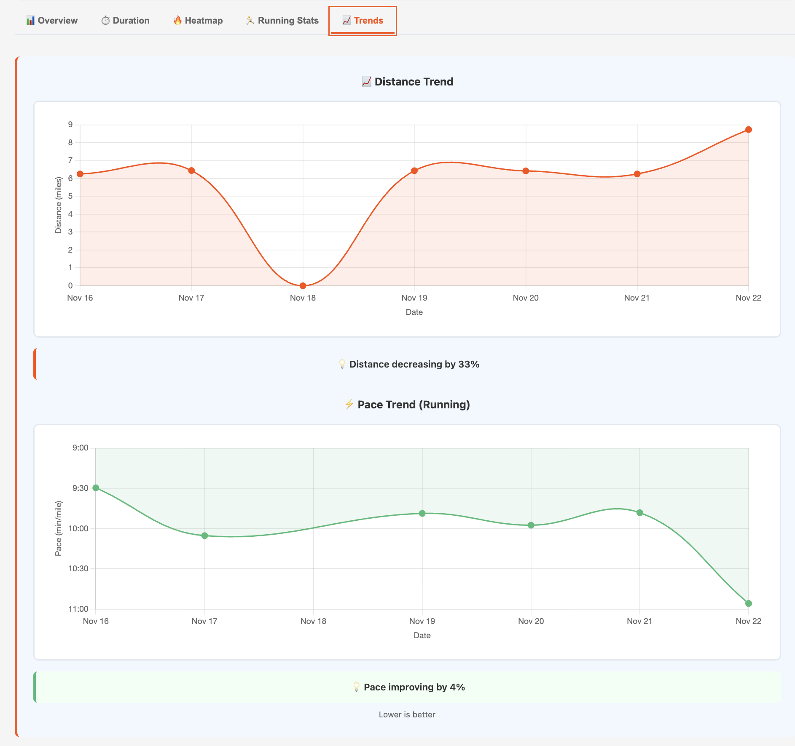

# Strava Activity Analyzer

Analyze and visualize your Strava activity statistics with beautiful charts and insights. Built with PHP and Chart.js, featuring real-time data from your Strava account.

## 📸 Screenshots

### Overview Tab


### Duration Analysis


### Activity Heatmap


### Running Stats


### Trends Analysis


> See all screenshots in [docs/images/](docs/images/)

## ✨ Features

### 📊 Dashboard & Analytics
- **Activity Overview** - Pie charts showing activity distribution by sport type
- **Duration Analysis** - Time spent breakdown with insights (most active type, weekly averages)
- **Date Range Filters** - 7/30/90/180 days, Year-to-Date, or custom date picker
- **Automatic Timezone Detection** - Shows accurate dates in your local timezone

### 🔥 Training Insights
- **Activity Heatmap** - Visual calendar showing workout consistency
- **Streak Tracking** - Current streak, longest streak, and gap analysis
- **Workout Statistics** - Active days, rest days, days since last activity
- **Intensity Levels** - Color-coded by time spent (< 1h, 1-2h, 2h+)

### 🏃 Running Analytics
- **Performance Metrics** - Total distance, runs, average pace
- **Personal Records** - Fastest pace, longest run, 10K+ runs count
- **Distance Distribution** - Histogram showing run distance patterns
- **Unit Toggle** - Switch between miles and kilometers

### 📈 Trends & Progress
- **Distance Trends** - Daily distance visualization over selected period
- **Pace Trends** - Track pace improvements over time (running only)
- **Trend Insights** - Automatic analysis with percentage changes
- **Running-Only Filter** - Focus heatmap on running activities

### 🎨 User Experience
- **Responsive Design** - Works on desktop, tablet, and mobile
- **Smooth Animations** - Polished interactions and transitions
- **Accessibility** - WCAG compliant with ARIA labels and keyboard navigation
- **Error Handling** - Clear messages with recovery actions
- **Session Persistence** - Date range preferences saved across visits
- **Activity Caching** - Fast performance with smart cache invalidation

### 🔒 Security & Performance
- **OAuth2 Authentication** - Secure Strava integration with PKCE
- **Token Refresh** - Automatic token renewal
- **Rate Limiting** - Built-in protection against abuse (100 req/min)
- **Rate Limit Handling** - Respects Strava API limits
- **Security Headers** - CSP, HSTS, X-Frame-Options, and more
- **Session Security** - HttpOnly, Secure, SameSite cookies
- **Input Validation** - Whitelist and regex validation on all inputs
- **Code Splitting** - Optimized JavaScript bundles (74KB gzipped total)

## 🚀 Quick Start

### Prerequisites
- PHP 8.1 or higher
- Composer
- Node.js and npm
- Strava API credentials ([Get them here](https://www.strava.com/settings/api))

### One-Command Setup

```bash
git clone https://github.com/arun-gupta/strava-stats-php.git
cd strava-stats-php
./quickstart.sh
```

The script will:
1. ✅ Check PHP, Composer, and npm versions
2. 📦 Install dependencies (composer + npm)
3. ⚙️ Guide you through `.env` configuration
4. 🏗️ Build frontend assets
5. 🚀 Start development server on http://localhost:8080

### Manual Setup

If you prefer manual installation or need production deployment:

```bash
# 1. Install dependencies
composer install
npm install

# 2. Configure environment
cp .env.example .env
# Edit .env with your Strava API credentials

# 3. Build assets
npm run build

# 4. Start server
php -S localhost:8080 -t public
```

Visit http://localhost:8080 and click "Connect with Strava" to get started!

> **Production Deployment?** See [docs/INSTALLATION.md](docs/INSTALLATION.md) for Nginx/Apache setup and security hardening.

## 🛠️ Tech Stack

### Backend
- **PHP 8.1+** - Modern PHP with type declarations
- **[Slim Framework 4](https://www.slimframework.com/)** - Lightweight routing and middleware
- **[Guzzle](https://docs.guzzlephp.org/)** - HTTP client for Strava API
- **[League OAuth2 Client](https://oauth2-client.thephpleague.com/)** - OAuth authentication with PKCE
- **[Monolog](https://github.com/Seldaek/monolog)** - Structured logging

### Frontend
- **[Chart.js](https://www.chartjs.org/) 4.4** - Interactive data visualizations
- **[chartjs-plugin-datalabels](https://chartjs-plugin-datalabels.netlify.app/)** - Data labels on charts
- **[Vite](https://vitejs.dev/)** - Lightning-fast build tool with HMR
- **Vanilla JavaScript** - No heavy frameworks, just modern ES6+

### Development & Tooling
- **Composer** - PHP dependency management
- **npm** - JavaScript package management
- **Terser** - JavaScript minification
- **Git** - Version control

## 📚 Documentation

### For Users
- **[Installation Guide](docs/INSTALLATION.md)** - Detailed setup, configuration, and production deployment
- **[Requirements](docs/requirements.md)** - Feature specifications and user stories

### For Developers
- **[Development Plan](docs/plan.md)** - Technical implementation roadmap
- **[Task Checklist](docs/tasks.md)** - Phase-by-phase development progress

## 🤝 Contributing

Contributions are welcome! Please feel free to submit a Pull Request. For major changes, please open an issue first to discuss what you would like to change.

## 📄 License

Apache License 2.0 - See [LICENSE](LICENSE) for details.

## 🙏 Acknowledgments

- Built with ❤️ using [Strava API](https://developers.strava.com/)
- Charts powered by [Chart.js](https://www.chartjs.org/)
- PHP routing by [Slim Framework](https://www.slimframework.com/)
